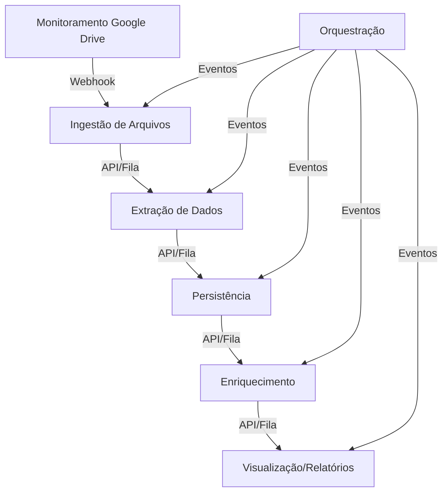

# Arquitetura em Microserviços para Análise de Licitações Públicas

## Visão Geral
Cada módulo do sistema será um microserviço independente, comunicando-se via APIs REST, filas de mensagens ou eventos. Isso permite escalabilidade, deploys independentes e maior robustez.

---

## 1. Serviço de Ingestão de Arquivos
- **Função:** Receber arquivos PDF/ZIP via upload ou integração com Google Drive.
- **Stack Sugerida:**
  - Python (Flask/FastAPI)
  - Google Drive API
  - Armazenamento: AWS S3, Google Cloud Storage ou local

## 2. Serviço de Extração de Dados
- **Função:** Extrair CNPJs/CPFs dos PDFs e classificar participantes.
- **Stack Sugerida:**
  - Python (FastAPI, Celery para processamento assíncrono)
  - pdfplumber
  - Comunicação: API REST ou fila (RabbitMQ, Redis)

## 3. Serviço de Persistência
- **Função:** Gerenciar banco de dados relacional, expor API para inserção/consulta.
- **Stack Sugerida:**
  - Python (FastAPI, SQLAlchemy)
  - PostgreSQL
  - API REST para CRUD

## 4. Serviço de Enriquecimento
- **Função:** Consultar APIs públicas e realizar scraping para enriquecer dados.
- **Stack Sugerida:**
  - Python (FastAPI, Celery)
  - requests, BeautifulSoup
  - Comunicação: API REST ou fila

## 5. Serviço de Orquestração
- **Função:** Coordenar o fluxo entre os microserviços, disparar eventos e monitorar status.
- **Stack Sugerida:**
  - Python (FastAPI)
  - Celery/RabbitMQ para orquestração
  - API REST para status/processamento

## 6. Serviço de Automação/Monitoramento
- **Função:** Monitorar Google Drive e disparar ingestão automática.
- **Stack Sugerida:**
  - N8N, Zapier, Make
  - Webhooks para integração

## 7. Serviço de Visualização/Relatórios
- **Função:** Consultar dados do banco e gerar relatórios/dashboards.
- **Stack Sugerida:**
  - Python (Dash, Streamlit)
  - Power BI/Tableau
  - API REST para consulta

---

## Melhorias e Stacks Adicionais

### API Gateway
- Centraliza autenticação, roteamento e monitoramento das APIs dos microserviços.
- Stack: Kong, NGINX, Traefik ou AWS API Gateway.

### Autenticação e Autorização
- Implemente OAuth2/JWT para proteger endpoints.
- Stack: Auth0, Keycloak, ou FastAPI com JWT.

### Observabilidade e Monitoramento
- Use Prometheus + Grafana para métricas e dashboards.
- Stack: Prometheus, Grafana, ELK Stack (Elasticsearch, Logstash, Kibana).

### Mensageria/Eventos
- Para comunicação assíncrona entre serviços.
- Stack: RabbitMQ, Apache Kafka, Redis Streams.

### Testes Automatizados
- Testes unitários, integração e contratos de API.
- Stack: Pytest, Postman/Newman, Schemathesis.

### CI/CD
- Automatize build, testes e deploy dos containers.
- Stack: GitHub Actions, GitLab CI, Jenkins.

### Documentação de APIs
- Gere documentação automática dos endpoints.
- Stack: Swagger/OpenAPI (nativo no FastAPI).

### Segurança
- Scan de vulnerabilidades nos containers.
- Stack: Snyk, Trivy.

### Escalabilidade
- Orquestração com Kubernetes para ambientes produtivos.

---

## Diagrama de Microserviços

---

## Observações
Esta arquitetura prioriza modularidade, escalabilidade e automação, utilizando Docker, Kubernetes, APIs REST, mensageria e monitoramento centralizado. Para exemplos práticos ou templates, solicite!